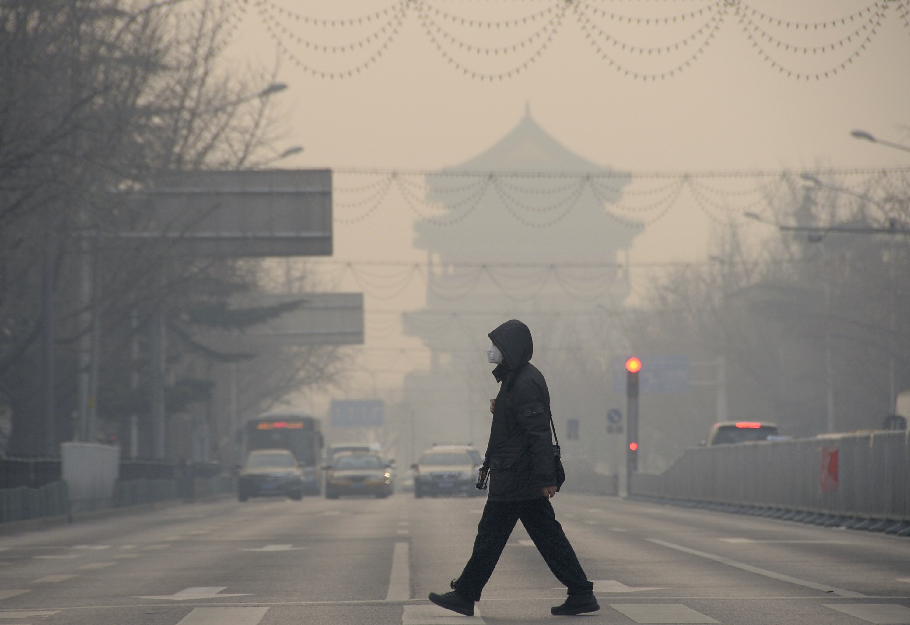

# ჰაერის დაბინძურება პეკინში

# Quiz 3

ჰაერის დაბინძურება დღესდღეობით ერთ-ერთი აქტუალური და მტკივნეული თემაა მსოფლიოსთვის და გადავწყვიტე, რომ პროექტი შემექმნა სწორედ ერთ-ერთი ქალაქის,კერძოდ პეკინის, ჰაერის მდგომარეობის შესახებ.სერვერთან დასაკავშირებლად ვიყენებ requests მოდულს და ასევე მოვიძიე air pollution API, რომლის საშუალებითაც შესაბამისი კოორდინატების მითითების შემდეგ სერვერიდან მომაქვს ინფორმაცია,ხოლო json მონაცემს ვინახავ ფაილში(json მოდულის დახმარებით) და შემდეგ მასთან ურთიერთქმედების შედეგად გამომაქვს ცნობები პეკინის ჰაერის დაბინძურების შესახებ, კონკრეტულად, 2021 წლის 1 მაისის 3საათისთვის.

ასევე ვიყენებ sqlite3 მოდულს, რომლის საშუალებითაც ვინახავ ჩემთვის საინტერესო ინფორმაციას ბაზაში. კერძოდ კი, ვქმნი ცხრილს, რომელიც ასახავს კონკრეტული თარიღისა და დროისთვის CO,PM10 da SO2 აირების რაოდენობას ქალაქში.
